<style>
	.markdown-body {
		box-sizing: border-box;
		min-width: 200px;
		max-width: 980px;
		margin: 0 auto;
		padding: 45px;
	}

	@media (max-width: 767px) {
		.markdown-body {
			padding: 15px;
		}
	}
</style>
<article class="markdown-body">
# h1 Homework - Miska Kytö
## a) Asennetaan webgoat

Ensimmäisenä päivitetään Kali ajamalla:
    
    sudo apt update && sudo apt upgrade
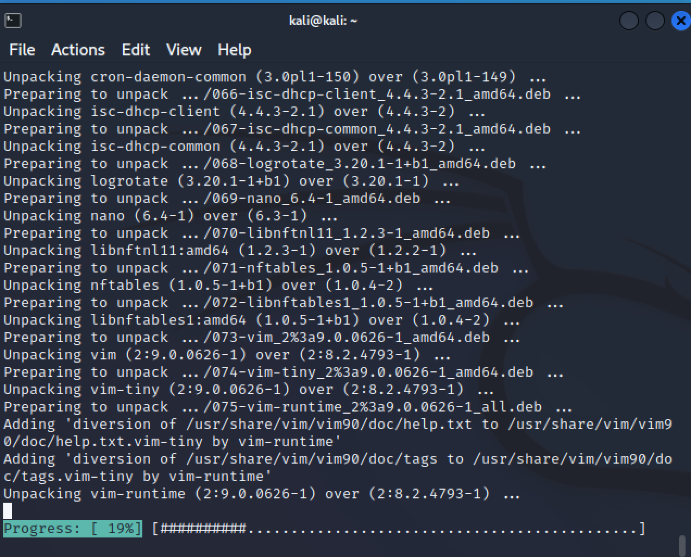
_varsinkin täysin uuden Kali-asennuksen kanssa tässä menee hetki_

Tämän jälkeen asennetaan webgoat ajamalla wget-komento, ja sen jälkeen käynnistämällä webgoat Javalla.
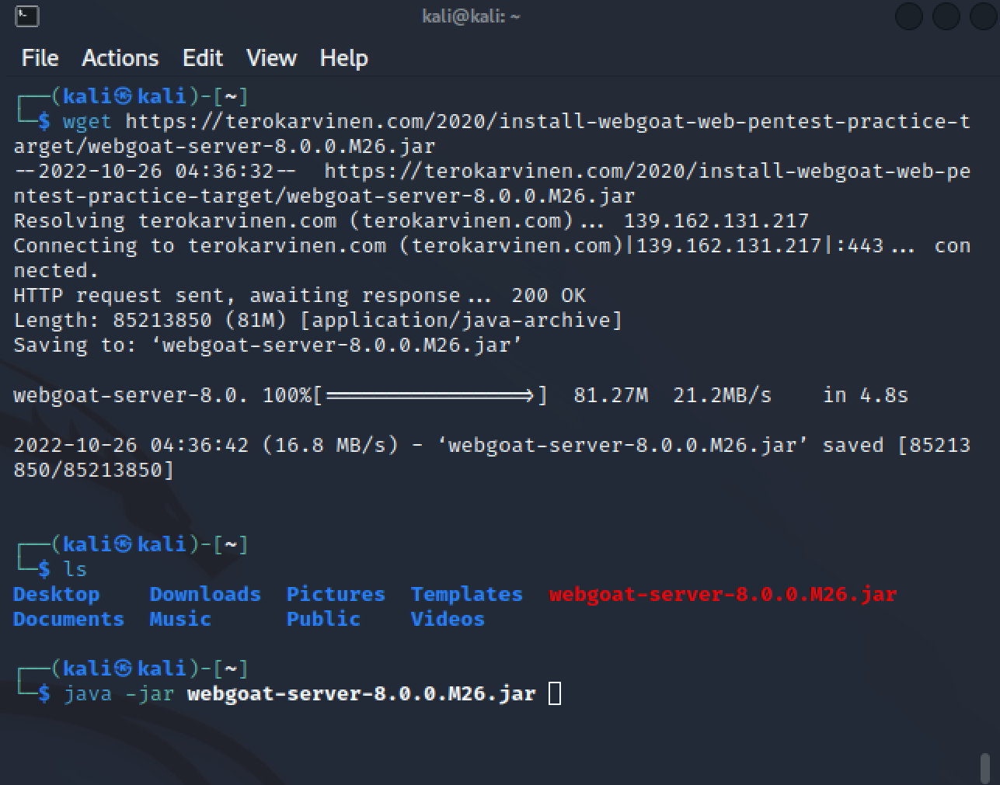

Nyt voimme avata selaimesta webgoatin, joka pyörii paikallisella laitteella portissa 8080.
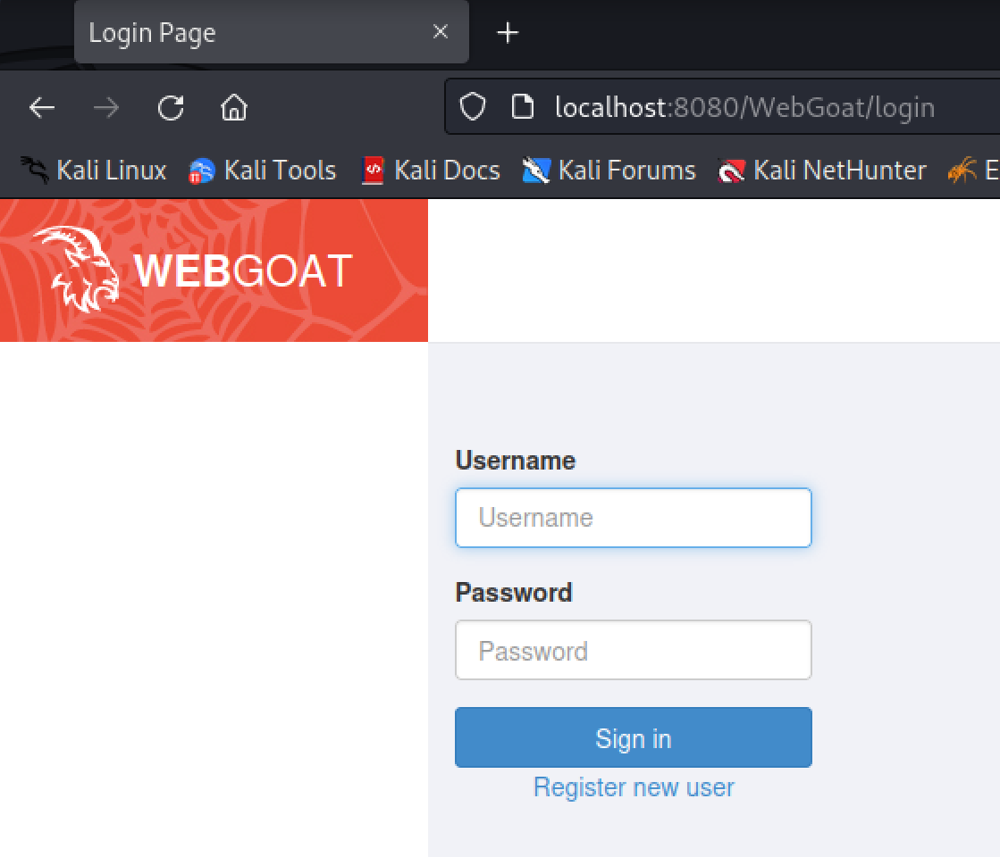

Käyttäjän luomisen jälkeen hakkerointi voi alkaa!
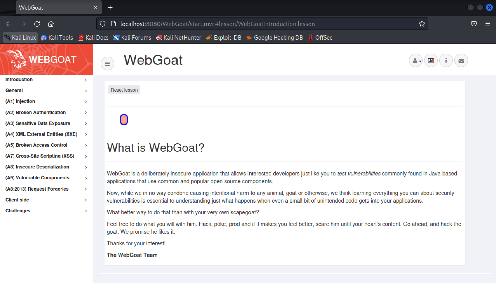

## b) Webgoat HTTP Basics & Developer tools
### HTTP Basics
Voimme lähettää nimemme kentässä, ja pysäyttää HTTP POST-komennon käyttämällä proxya. Itse käytän tässä Burpsuitea.
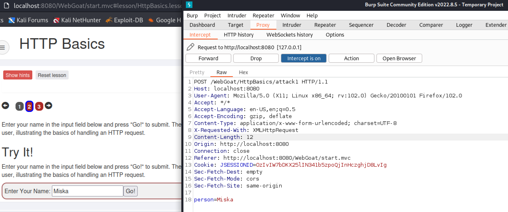
Seuraavassa kohdassa pyydetään kertomaan oliko aikaisempi komento POST vai GET, sekä syöttämään "salainen numero"
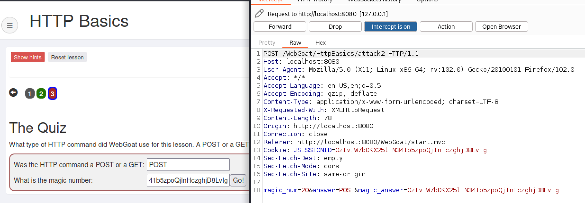
Syötin salaiseksi numeroksi Cookieni, sillä tiesin että muokkaan POST-komentoa ennen kuin sen lähetän. Ja kuten näemme, selain lisää itse POST-komentoon magic_num-kohdan, joka on 20.

Seuraavaksi voin vain muokata vastaukseni oikeaksi, ja painaa burpsuitesta "forward"-nappulaa, lähettäen POST-komentoni serverille.
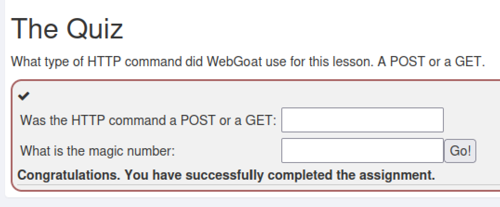

### Developer tools

Aluksi tutustutaan Chromen (tai tässä tapauksessa Firefoxin) kehittäjätyökaluihin, jotka saa auki painamalla CTRL + SHIFT + I.
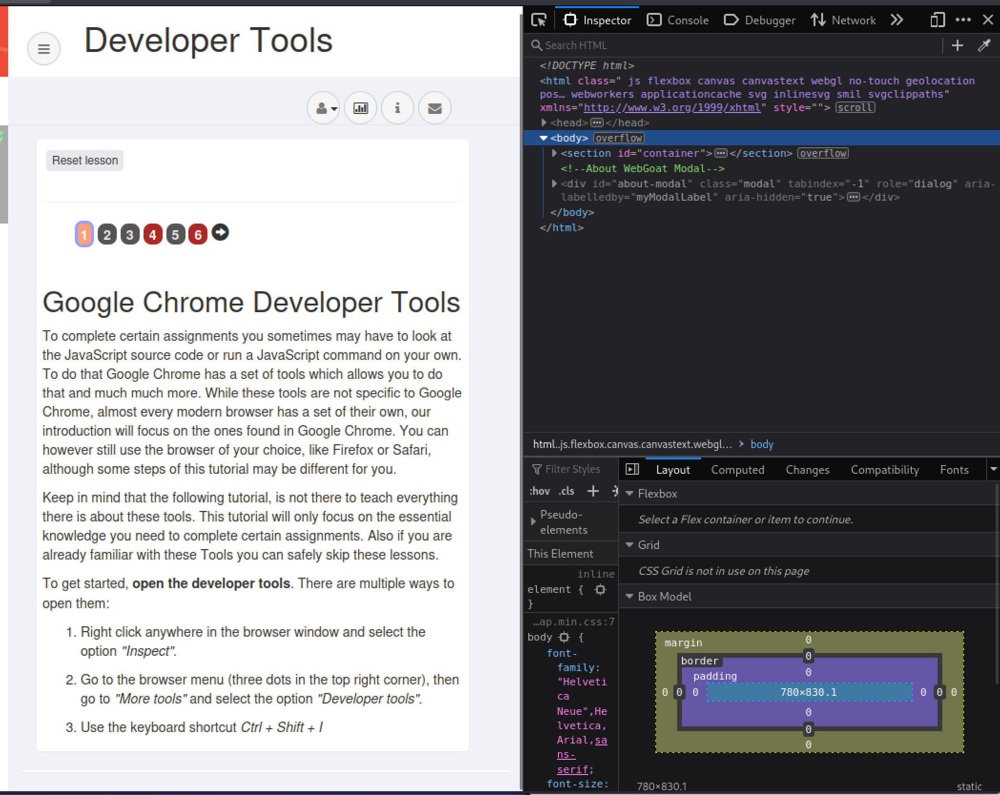

Ensimmäiseksi tutustutaan konsoliin, jossa tehtävä opettaa suoritaamaan JavaScriptiä.
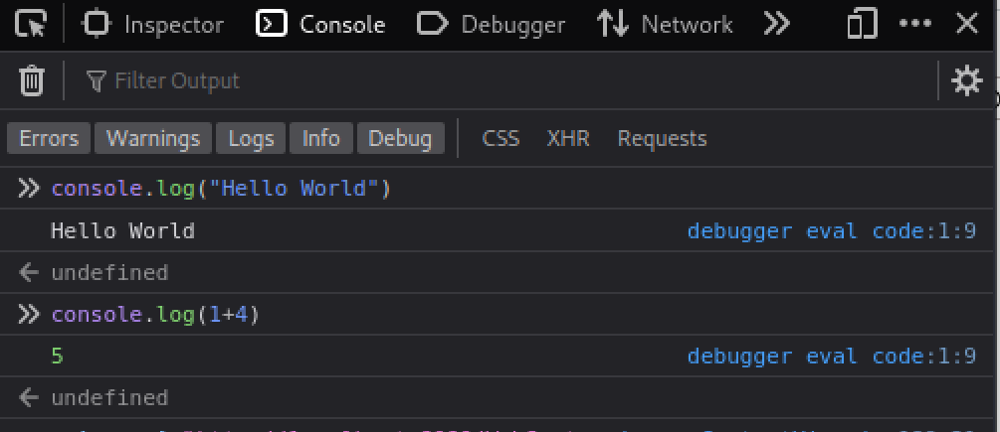

Seuraavaksi suoritetaan tehtävän antama oma komento, joka vastaa tekstillä, josta löydämme vastauksen tehtävään.
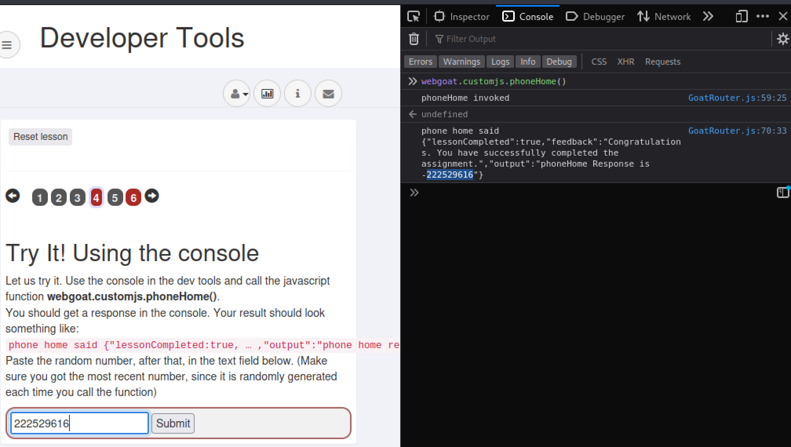

Lopuksi vielä lähetämme pyynnön serverille painamalla painiketta, ja tutkimme tuota pyyntöä kehittäjätyökaluilla "Network"-tabissa. Täältä löydämme oikean vastauksen viimeiseen tehtävään.
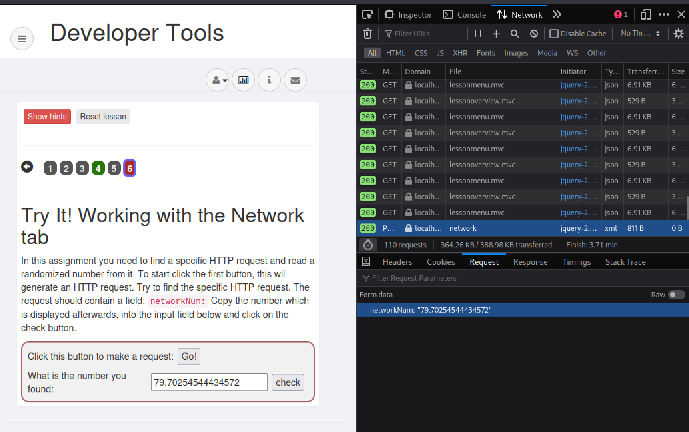


## c) Overthewire - Bandit 0-2
Ratkaistaan 3 ensimmäistä tasoa Overthewiren Bandit-tehtävästä.

### Bandit 0
Ensimmäisessä tehtävässä ssh-yhteyden ottaminen serverille riittää:
    ```ssh bandit0@bandit.labs.overthewire.org -p 2220
    ```
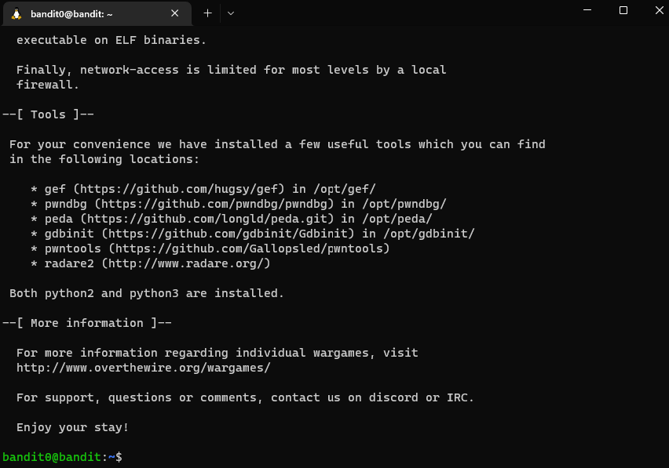
### bandit 0 => 1
   Salasana löytyy tiedostosta readme, joka on luettavissa komennolla:
    ```cat readme
    ```
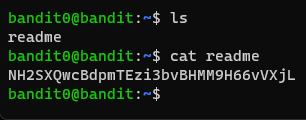

### bandit 1=>2

Tällä kertaa salasana on tiedostossa, joka on nimetty "-". Tämä on kuitenkin Bashissa merkki, joten suora `cat -` ei toimi. Tiedosto voidaan kuitenkin lukea ohjaamalla sen sisältö stdout:iin tai viittaamalla juuri tähän tiedostoon käyttämällä `./-` komentoa:
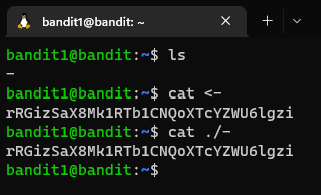

## d) Asenna Kali Linux virtuaalikoneeseen

Kali Linux on penetraatiotestaamiseen luotu Linux-jakelu, johon on sisäänrakennettuna monia työkaluja, joita pentest-käytössä voidaan käyttää.

Kali Linuxin asennus virtuaalikoneeseen on helppoa, sillä projektin sivuilta tarjotaan suoraan Virtualbox-sovelluksessa käytettävä config-tiedosto, sekä virtuaalinen levynkuva.

Tämän lataamisen jälkeen tarvitsee ainoastaan avata .vbox-tiedosto, ja käynnistää virtuaalikone!
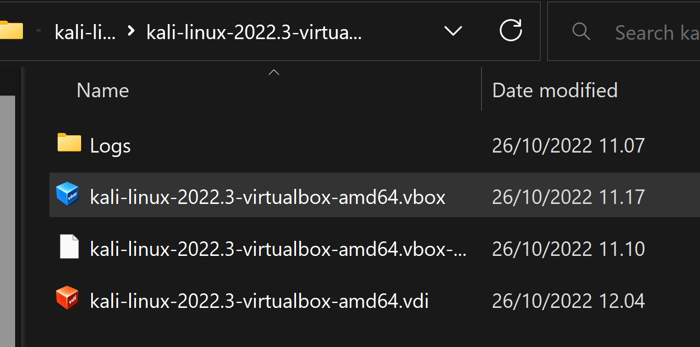
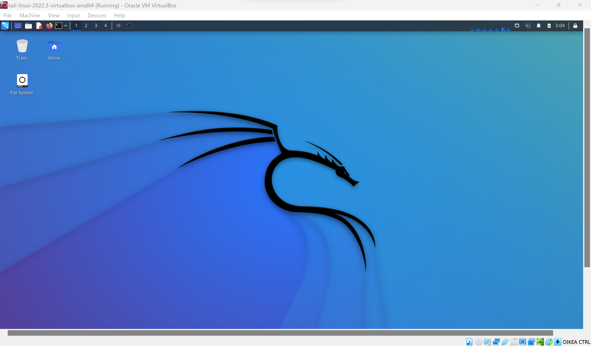
Ready to go!

## e) Challenge.fi

Valitsin ratkaistavaksi tehtäväksi tehtävän "Cert Checking", joka on melko helppo tehtävä.
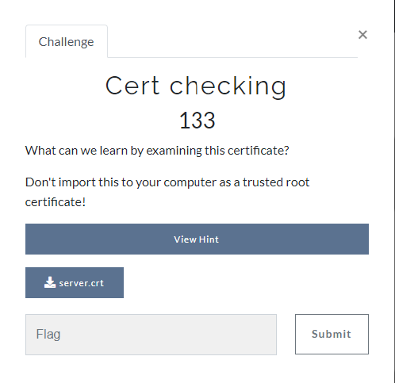

Tehtävä antaa ladattavaksi crt-tiedoston, jota tutkimalla löydämme Issuer-tiedoista lipun.
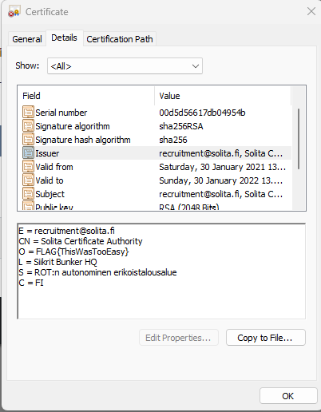

## x) Herrasmieshakkerit

Itse olen kuunnellut Herrasmieshakkerit-podcastia jo muutaman vuoden ajan. Podcastia pyörittävät "Suomen tietoturvakentän viralliset vanhukset", eli WithSecuren (entinen F-Secure) Tomi Tuominen ja Mikko Hyppönen. Varsinkin Mikko on varmaan tuttu jokaiselle suomalaiselle tietoturvakenttää seuraavalle ihmiselle. 

Yksi lempijaksoistani on 0x10, eli "Järjestelmänvalvoja", jossa haastatellaan Sami Laihoa, joka on yksi maailman tunnetuimmista Windows-asiantuntijoita. Tämä jakso oli henkilökohtaisesti kiinnostava, sillä työskentelen töissä juuri Microsoftin-tuotteiden kanssa konsulttina. Myös Samin historia tapahtumissa puhujana on itselle mielenkiintoinen sillä tähtään itse samaan.

Jaksossa puhuttiin muun muassa Windowsin ylläpidosta sekä Zero Trust -mallista. Zero Trust on tietoturvan malli, jossa ei luoteta mihinkään, vaan kaikki aina tarkistetaan. Tämä malli on erittäin suosittu maailmalla monissa yrityksissä, ja se onkin nykyään yksi tärkeimmistä tietoturvan konsepteista. Laiho myös korostaa sitä, miten Microsoft-tuotteiden tietoturva on vuosien varrella kehittynyt huomattavasti positiiviseen suuntaan. Kuitenkin tämä kaikki tietoturva lähtee siitä, että järjestelmän takana on osaava ylläpitäjä.

Kiinnostavaa oli Samin idea siitä, että tietoturvan kouluttaminen ihmisille on yritykselle lopuksi halvempaa, kuin paremman tietoturvan rakentaminen. Itse tietoturva-aiheiden kouluttajana tämä on hauska kuulla, ja yksi motivaatioistani.
</article>