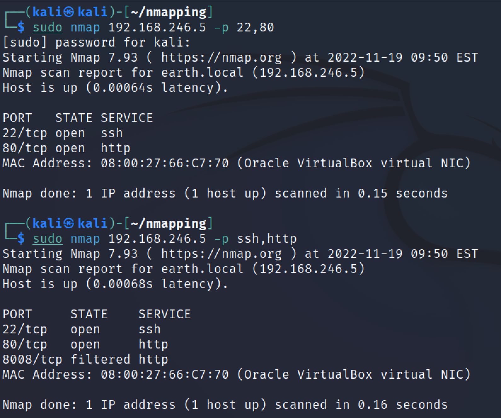
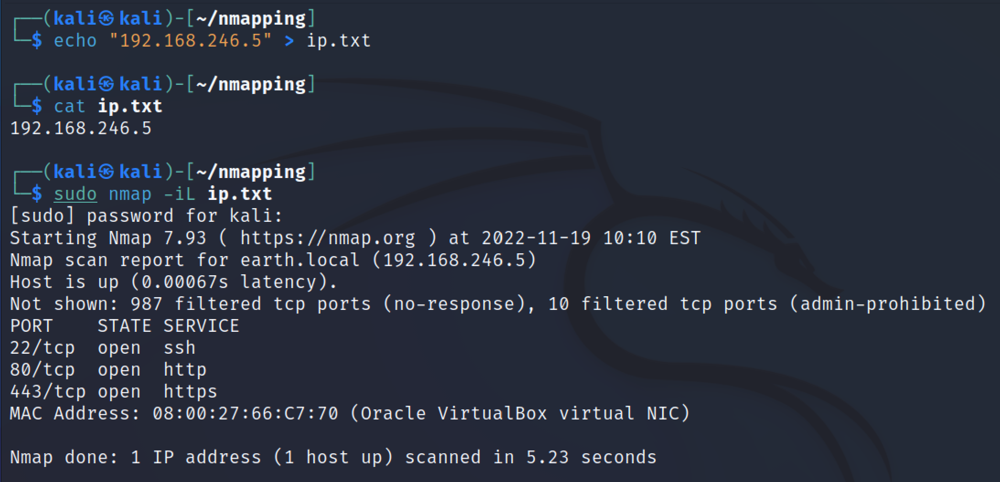
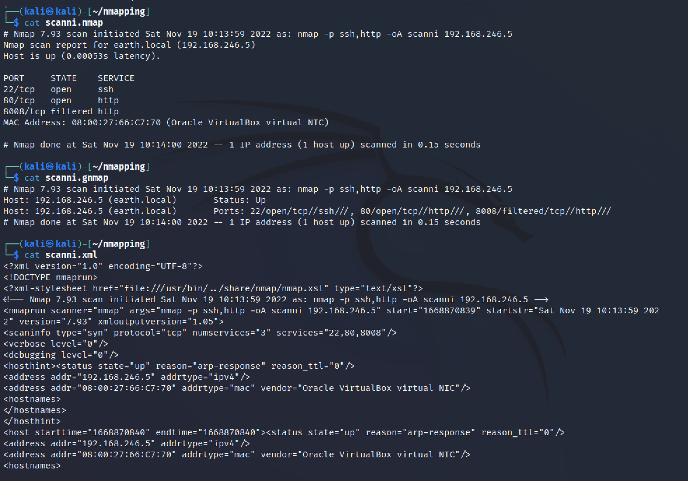
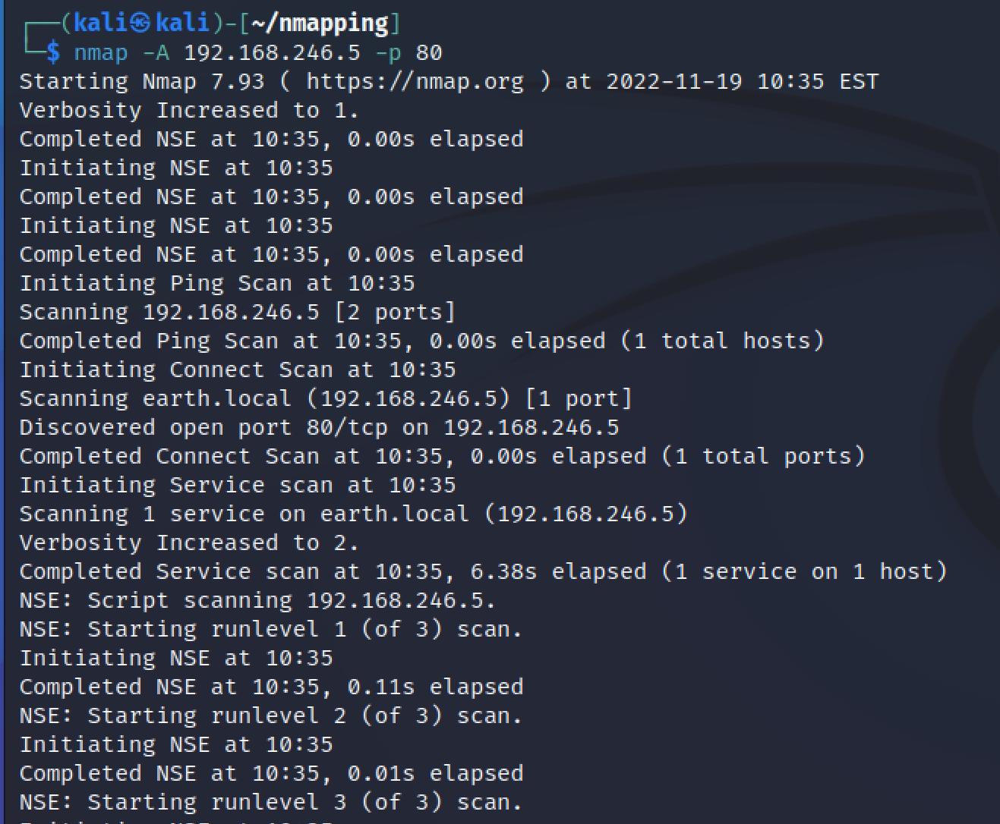
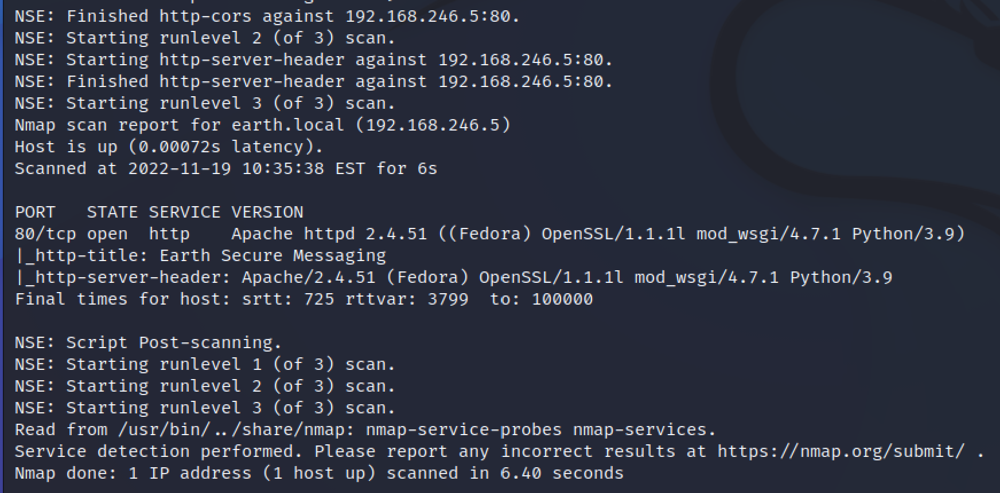
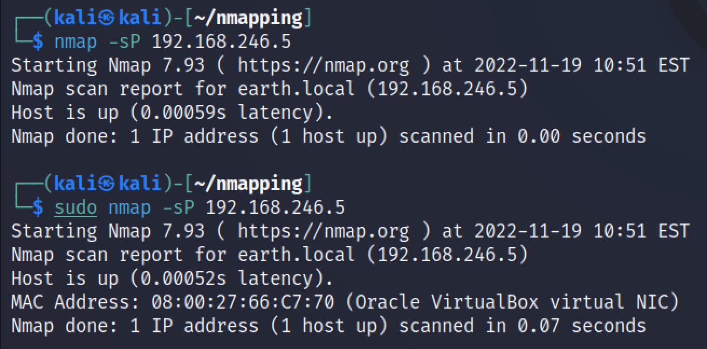
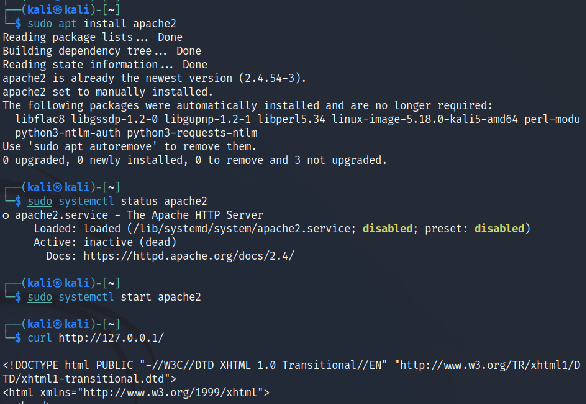
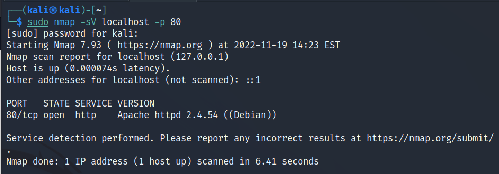
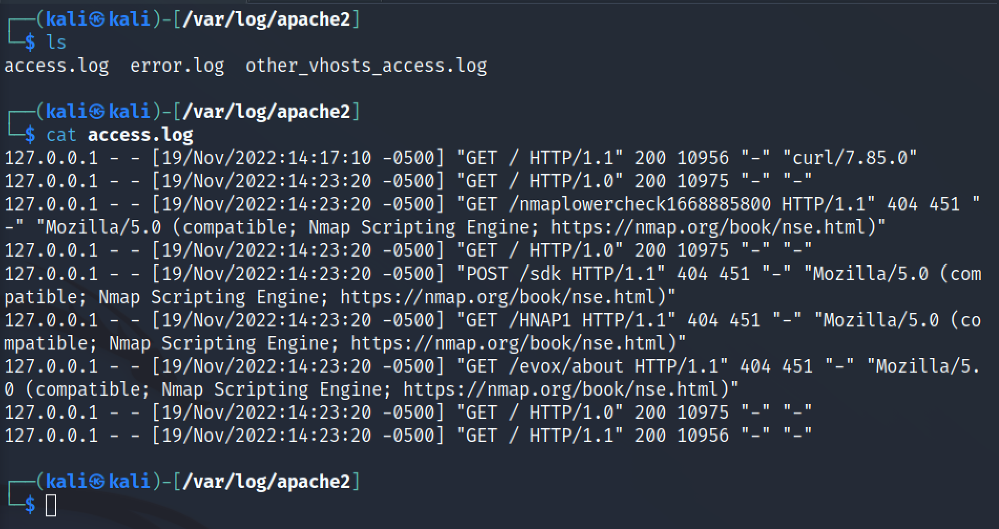

# h4 - Miska Kytö

____

## z) Muistiinpanoja videoista/artikkeleista

### The Art of Hacking: Surveying Essential Tools for Active Reconnaissance

- Aktiiviseen tiedusteluun on myös muita skannereita kuin nmap, jotka ovat hieman eri käyttötarkoituksiin. Esimerkiksi masscan on nopea porttiskanneri, jolla voi nopeasti skannata suuriakin verkkoja.
- Nmapin nopeutta voidaan muokata -T flagillä.
- -Pn flagillä voidaan skannata kaikki portit, vaikka nmapin mukaan kohde olisi offline. Tämä auttaa skannausta joidenkin kohteiden palomuurien läpi.
- UDPprotoscanner on UDP-skannaukseen tehty ohjelma, joka on huomattavasti nopeampi UDP-skannauksessa kuin nmap.
- EyeWitness-työkalu on hyödyllinen suurien verkkojen web-palveluiden läpikäymiseen. Ohjelma ottaa kuvakaappauksen jokaisesta sivusta, kerää hieman infoa sivuista ja vetää tiedon yhteen omaan verkkoportaaliinsa.
- Haavoittuvuusskannereilla voidaan skannata verkossa olevia laitteita tai web-palveluita ja löytää helposti haavoittuvuuksia. Laiteskannereita ovat esimerkiksi ilmainen OpenVAS tai suosittu Nessus, kun taas puolestaan web-skannereita ovat tunnetut Nikto, Wordpressille luotu WPScan ja SQL injektioiden automatisointiin tehty SQLMap.
  
### Getting Started with Nmap

- Kirjassa kuvattu Avatar Online -firmaan keskittyvä tarina hyvin alleviivaa, miten tärkeää on ennen aktiivisen tiedustelun aloittamista vielä varmistaa, että kaikki skannattavat entiteetit ovat kyseisen firman hallussa, ja että skannaus on sallitua.
- Nmapin output-tiedostoihin pystyy lisäämään aikaleiman lisäämällä tiedostonimeen %D.
- On olemassa erillinen ohjelma nmap-diff, jolla voidaan helposti käsitellä kaksi skannausraporttia ja vertailla niitä ja niiden muutoksia.

### Nmap Reference Guide

- Ilman erillistä konfigurointia nmap skannaa ensimmäiset 1000 porttia kohteesta. Porttien tila voidaan luokitella kolmeen päätilaan:

- Open
  - Portti on avoin ja yhteys onnistuu.
  - Tarkemmin nämä portit vastaavat nmapin skanniin lähettämällä joitain paketteja.
- Closed
  - Portti ottaa vastaan yhteyden, mutta se ei vastaa mitään. Tämä tarkoittaa että portissa ei ole mitään palvelua, mutta skannin tuloksella voidaan päätellä, onko kohde olemassa.
- Filtered
  - Tässä tilassa nmap ei osaa sanoa, onko portti auki vai kiinni, sillä se ei saa yhteyttä porttiin.
  - Yleensä palomuurit tai muut työkalut estävät porttien vastaanottamiseen, jolloin nmap ei saa yhteyttä porttiin.
  - Voi aiheuttaa looppeja, jossa nmap lähettää saman paketin monta kertaa samaan porttiin, luullen että paketti vain katosi matkalla.

- Nmapissa on mahdollista käyttää monia erilaisia skannausmetodeja, jotka lähettävät hieman erilaisia paketteja tai käyttävät hieman erilaisia skannausstrategioita. Näin nmapilla skannaus onnistuu monissa tilanteissa, vaikka yksi tietty metodi olisikin estetty. Esimerkiksi jos kohde tunnistaa TCP SYN -skannauksen ja estää sen, voi kuitenkin TCP connect -skannaus puolestaan toimia.
- Nmapin erilaisia skannausmetodeja tutkitaan seuraavassa tehtävässä. 

___

# a) nmap TCP connect scan -sT

TCP connect skanni eroaa normaalista skannista siten, että ohjelma ei lähetä suoraan pakettia ohjelmasta kohteeseen, vaan käyttää käyttöjärjestelmän TCP-protokollaa, joka muodostaa yhteyden sen puolesta. Samoin tavoin nmap ei suoraan vastaanota paketteja kohteelta, vaan hakee sen käyttöjärjestelmän API:sta. Tätä käytetään yleensä silloin, jos hyökkääjällä ei ole oikeutta lähettää raakoja paketteja suoraan nmapista (eli käyttäjällä ei ole root-oikeuksia, tai nmappia ei ajeta sudolla), tai jos skannataan ipv6-verkkoja. Yleensä kuitenkin normaali SYN-skanni on parempi vaihtoehto.

Tässä näemme, miten nmap (.4) ja kohde (.5) porttiin 22 (SSH) käyvät läpi normaalin TCP kättelyn (SYN => SYN/ACK => ACK => RST) 

# b) nmap TCP SYN

SYN-skanni on nmapin oletus-skannaustapa ja siksi yleisin. Toisin kuten TCP connect skannaus, se lähettää paketit raakana suoraan ohjelmasta, jonka takia se vaatii root-oikeudet. SYN skanni on historiallisesti ollut enemmän huomaamaton, sillä se perustuu siihen, että kokonaista TCP kättelyä ei tehdä, vaan vastaanottaessa SYN/ACK paketin, nmap sulkee yhteyden eikä vastaakkaan pakettiin. Nykyään kuitenkin suurin osa työkaluista ja palomuureista tunnistaa tämän, jonka takia SYN skannaus ei enää ole niin "stealth".

Tässä näemme, miten nmap ei vastaa SYN/ACK pakettiin, vaan sulkee yhteyden välittömästi RST-paketilla.

# c) nmap ping sweep -sn

Niin kutsuttu "ping sweep", on skannaustila, jossa nmap lähettää ainoastaan yhden TCP-paketin, joka on tyhjä. Tällöin skannaus tapahtuu todella nopeasti, mutta jättää paljon kertomatta, sillä, koska paketti on tyhjä, ei tiedetä yhtään, miten kohde siihen vastaa. Tällöin ei tiedetä, onko portti avoin vai filtteröity, tai mitään muuta. Tiedetään vaan, meneekö paketti perille vai ei.

Tämä skannaus voidaan toteuttaa myös flagilla -sP, eli "skip port scanning".

Tässä näemme, miten TCP paketin pituus on 0, eli siinä ei ole mitään dataa.

# d) nmap don't ping -Pn

-Pn eli "don't ping" flag saa nmapin aloittamaan porttiskannauksen ilman pingausta. Ilman flagia nmap lähettää ensin yhden paketin kohteeseen varmistamaan, että se on verkossa, ennen kuin porttiskannaus aloitetaan. Kuitenkin tällä flagilla, tämä voidaan ohittaa. Tämä on hyödyllistä, jos skannataan vain yhtä kohdetta, jonka tiedetään jo olevan verkossa.

# e) nmap version detection -sV

Tässä skannauksessa nmap ei katkaise yhteyttä heti kohteen vastauksen jälkeen, vaan puolestaan muodostaa yhteyden, jolloin serveri (tässä tapauksessa SSH-portista) vastaa kertoen SSH:n version. Tämän jälkeen nmap lopettaa yhteyden.

# f) nmap porttien valinta

Skannattavia portteja voi Nmapissa valita monella tavalla. Jos skannattavia portteja ei erikseen määrittele, nmap skannaa 1000 yleisintä porttia. Skannattavia portteja voi vaihtaa -p flagin avulla, jolloin voidaan määritellä skannattavat portit seuraavin keinoin:
- Listana (esim. -p 21,22,80,443)
- Listana, eroteltuna protokollan mukaan (TCP/UDP esim. -p T:21,22,U:53,111,137,138,139)
- Porttien välinä (esim. -p 1-443)
- Yleisen palvelun nimen mukaan (esim. -p ftp,ssh,telnet,http,https)
- Kaikki portit 65535 asti (-p-)

Tässä nmap valitsee samat portit, vaikka syntaksi on eri.

# g) nmap ip-osoitteiden valinta
 
Kohteen eli IP-osoitteen valinta Nmapissa toimii melko samalla tavalla kuin porttien valinta. Nmap voi skannata kerralla yhden tai useampia kohteita, jotka voidaan valita seuraavin keinoin:
- Luettelona osoitteita (esim. 192.168.1.2 10.10.14.2)
- Luettelona tiedostosta (esim. -iL osoitteet.txt)
- Verkkomaskilla (esim. 192.168.1.0/24 skannaa osoitteet .1-.254)
- DNS-nimellä (esim. www.scanme.nmap.org)
- IPv6-osoitteella, tukee myös verkkomaskilla skannaamista (esim. 2001:db8::/32)

Tässä esimerkissä skannataan osoite, joka määritellään tiedostossa.

# h) nmap output files -oA

Nmap voi kirjoittaa skannauksen tulokset tiedostoihin. Tämä on hyödyllistä, sillä kohdetta ei tarvitse joka kerta skannata uudestaan, jos tiedetään että tulos ei muutu.

-oA flagilla saadaan nmap tallentamaan tulokset kaikissa muodoissa, joita on kolme:

-.nmap - Tämä on oletustiedostomuoto, joka tallentaa melko suoraan nmapin tulostuksen tiedostoon.

-.gnmap - Tämä on samanlainen kuin normaali .nmap tiedosto, mutta se tallentaa yhden kohteen tulokset aina yhteen riviin. Tämä on siksi, että jos skannataan useita kohteita, tästä tiedostosta on helpompi hakea tuloksia mm. grep komennolla. Siitä tuleekin tiedoston nimi gnmap, tarkoittaen "greppable nmap".

-.xml - Tässä tulokset tallennetaan standardisoidusti XML-muotoon, jolloin tulokset voidaan viedä käsiteltäväksi erilaisiin ohjelmistoihin, kuten haavoittuvuusskannereihin tai tietokantoihin.

Tiedostomuodot voidaan valita myös erikseen komennoilla -oN, -oG ja -oX.

# k) nmap ajonaikaiset toiminnot

Skannin ajon aikana voidaan muokata printattavaa sisältöä ajonaikaisilla komennoilla, joita on kolme, ja joita voidaan nostaa tasoissa 0-10 painamalla kyseistä näppäintä uudestaan:

- "v" eli verbosity, tämä lisää tulostettavan sisällön määrää, jos haluaa nähdä ylimääräistä tietoa.

- "d", eli debug, joka tulostaa ajon aikana debug-viestejä. Tämä on hyödyllistä, jos esimerkiksi kehittää omaa skriptiä nmappiin, jota haluaa testata.

- "p", eli packet tracking, joka kytkee päälle ajon aikana lähetettävien pakettien seurannan. Tämä on hyödyllistä, jos haluaa seurata nmapin lähettämiä paketteja, eikä halua käyttää ulkoista työkalua, kuten Wiresharkia. Tämä asetus voidaan kytkeä vain päälle tai pois, eikä tasoittain.

# l) 'sudo nmap' vs 'nmap'.

Nmap pitäisi yleensä ajaa sudo-oikeuksilla, sillä ilman root-oikeutta nmap ei pysty lähettämään raakoja paketteja, kuten kohdissa a ja b käsiteltiin.

Esimerkiksi ping sweep skannaus ilman sudo-oikeuksia ei kerro kohteen mac-osoitetta, toisin kuin sudo-oikeuksilla.

# m) nmap -A vs ilman

Vertaillaan, kuinka paljon -A flag vaikuttaa skannin ajon nopeuteen ja lähetetyn liikenteen määrään. Nopeutta voidaan tutkia ajamalla "time"-komento. Lähetetyn liikenteen määrää tutkin puolestaan vinkeistä löytyneellä nethogs-ohjelmalla.

### ilman -A flagia:

### A flagilla:

Kuten nähdään, -A flagilla skannaus kestää n. 5 kertaa pidempään, sekä se lähettää melkein 2 kertaa enemmän liikennettä.

# d) Piiloutuuko nmap-skannaus hyvin palvelimelta?

Tutkitaan, kuinka helppoa tai vaikeaa nmapin skannauksen tunnistaminen on palvelimelta. Asennetaan tätä varten Apache-webpalvelin.

    sudo apt install apache2

Apache on Kali Linuxissa jo valmiiksi asennettu, joten meidän pitää vain käynnistää se!

    sudo systemctl start apache2

Seuraavaksi tehdään sivulle nmap-skannaus. Valitsin porttiskannauksen versiontunnistuksella, sillä näemme samalla, jääkö järjestelmään merkkiä version enumeroinnista.

Voimme seuraavaksi tutkia apachen logitiedostoja, jotka löytyvät linuxissa polusta /var/log/apache2/.

Logista näemme, että nmap lisää suoraan pyyntöjen user agent -kenttään "nmap", jolloin palvelin voi helposti tunnistaa skannauksen. Jos haluaisi helposti estää (tai oikeastaan vain vaikeuttaa/hidastaa) skannausta tulevaisuudessa, voisi konfiguroida palvelimen estämään pyynnöt, joissa user agent kohdassa mainitaan "nmap".

Näemme myös, kuinka versiotunnistus tuntuisi toimivan niin, että nmap pyytää palvelimelta muutaman sivun, jonka tietää johtavan 404-virheeseen. Tämä on siksi, että Apachen oletussivu 404-virheessä sisältää palvelimen versionumeron.

Nmap siis on oletusasetuksilla melko helppoa tunnistaa, joten ei kannata olettaa olevansa täysi ninja.

# e) UDP-skannaus: mahdollisuudet

UDP-skannaus eroaa normaalista porttiskannaamisesta huomattavasti, sillä pyynnöt lähetetään UDP-protokollan läpi yleisen TCP-protokollan sijasta. UDP-skannaamisella voidaan löytää kohteista palveluita, jotka eivät yleensä toimi TCP-protokollan kautta, kuten esimerkiksi DNS, tai erilaiset videostreamaus tai pelipalvelut.

# f) UDP-skannaus: ongelmat

Ongelmia UDP-skannauksen kanssa kuitenkin on, ja nämä johtuvat suurimmaksi osaksi protokollan toimintatavasta. UDP-skannauksessa ei ole mahdollisuutta tarkistaa, onko palvelua edes olemassa, jos se ei lähetä dataa takaisin skannerille. Tämä tarkoittaa, että jos skannattava portti hyväksyy liikennettä, mutta ei vastaa mitenkään paketteihin, jää nmap lähettämään paketteja uudestaan ja uudestaan. Lopuksi jos portti ei vastaa, ei nmap voi myöskään erotella avoimia portteja filtteröidyistä, joten lopuksi ei ole tietoa, onko kyseisessä portissa mitään palvelua edes käynnissä.

Tämä johtaa siihen, että skannaus kestää huomattavasti kuin TCP-skannauksessa, ja se lähettää paljon enemmän liikennettä.

Toinen puoli UDP-skannauksesta, joka hidastaa sitä huomattavasti on käyttöjärjestelmien, kuten Linuxin omat ominaisuudet. UDP-palvelussa on tyypillistä, että suljetun portin vastaanottaessa yhteyden, laite vastaa ICMP paketilla, joka kertoo portin olevan kiinni. Linux mm. rajoittaa tälläisten "ICMP error" pakettien vastaanottamisen yhteen per sekunti, jonka nmap tunnistaa ja hidastaa skannia tarkoituksellisesti, ettei käyttöjärjestelmä vain pudota paketteja. Käytännössä nmap pystyy skannaamaan vaan noin yhden UDP-portin sekunnissa.

Nmapin reference guidessa mainitaan hyvin, miten UDP-skannauksessa kaikkien porttien (1-65535) skannaus kestää näiden rajoitusten takia n. 18 tuntia.

___

## Lähteet:

[Tehtäväsivu (terokarvinen.com)](https://terokarvinen.com/2022/tunkeutumistestaus-ict4tn027-3010-syksylla-2022/)

[The Art of Hacking: Surveying Essential Tools for Active Reconnaissance - O'Reilly learning](https://www.oreilly.com/videos/the-art-of/9780135767849/9780135767849-SPTT_04_04/)

[Nmap network scanning - Getting started with Nmap](https://nmap.org/book/intro.html)

[Nmap Reference guide](https://nmap.org/book/man.html)